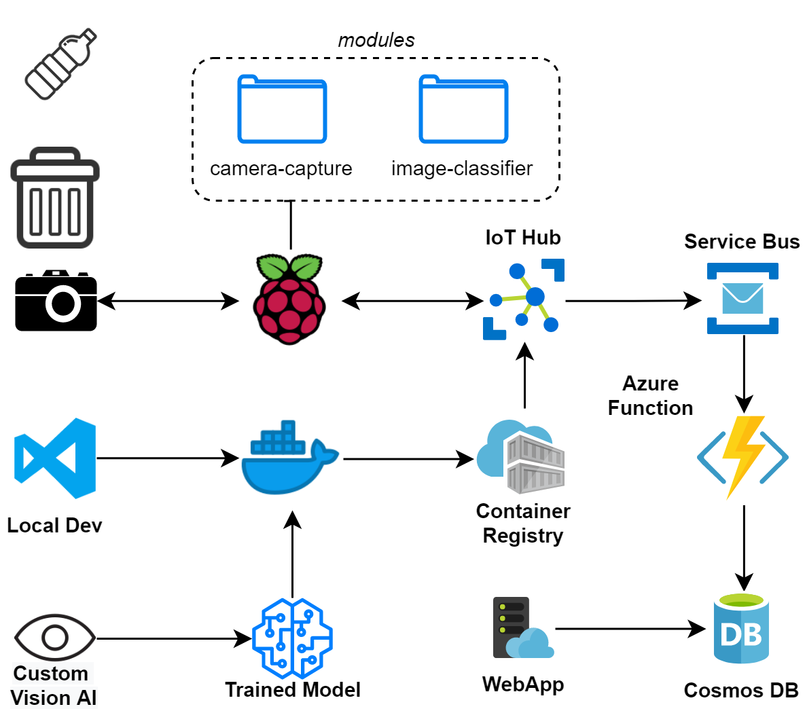
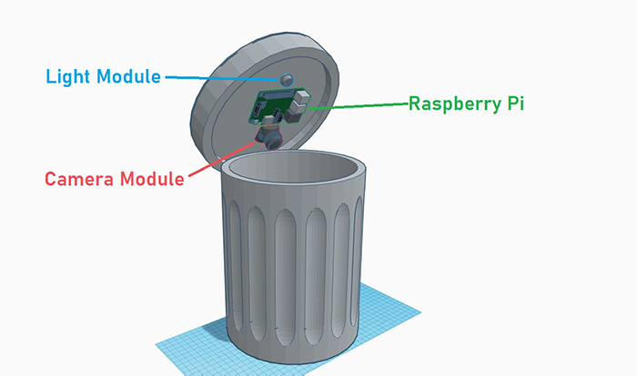
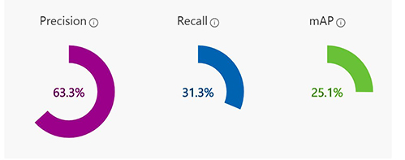

# Trashè

Trashè is a SmartBin which aim to help you get better at recycling. Making use of Azure IoT Edge we're able to leverage our trash detection model to detect plastic, glass & metals in realtime.

## Inspiration

---

TODO

## What it does

---

Trashè is an IoT Smart Bin system that leverages AI at the edge in order to detect and alert households to accidental disposal of recyclables in the trash.

## How we built it

---

Trashè leverages Azure IoT Edge and a number of other Azure services in order to detect, process and respond to actions.

The high level design we based the bin system on can be seen in the image below. This was our inspiration and gave us a good idea of what we wanted to achieve early on in development.

## Challenges we ran into

---

There were a number of challenges that we ran into during the design and execution phase of this project.

### Dark Bin

The first problem was the lack of lighting inside the bin when the lid is on. A key part of our design was to ensure the system didn't change the way people had to interact with the bin in order to be effective. With this in mind we needed to design a lighting system that would illuminate the contents of the bin allowing it to be captured with the installed camera.

The solution for this was a small [USB LED light](https://www.altronics.com.au/p/d0385-dimmable-usb-gooseneck-led-light/) that could be controlled over USB or by a touch sensitive button

### Hand Annotated Datasets

A key part of our design was to incorporate a custom Machine learning model that could classify different kinds of trash. There were two existing datasets that we looked into:

* [garythung/trashnet](https://github.com/garythung/trashnet)
* [pedropro/TACO](https://github.com/pedropro/TACO)

Both of these were ok in their own rights however lacked usable annotations for this project specifically. They were both also distinct and I wanted to incorporate the data from each into our new model.

In the end I classified all the images used in both datasets by hand in [https://customvision.ai](https://customvision.ai) and was able to get a fairly good precision considering the number of labels we had (14 types).

I consider this outcome to be perfectly reasonable for this use-case currently, and gives us something to work on moving forward.

## Accomplishments that we're proud of

---

### End to End Solution

Initially we only planned to work on a Vision model, however as we progressed we became more ambitious and eventually built out the end-to-end solution we're submitting now.

### Open Sourced Guide

Another thing I'm really proud of is the level of details put into the guide written as I built out this system. Not only should all steps be automated, but they give a good understanding of the decisions made during the development of Trashè.

* [01 - Raspberry Pi Installation](instructions/01_raspberry_pi.md)
* [02 - Azure IoT Edge Software Pre-requisites](instructions/02_azure_iot_edge.md)
* [03 - Azure IoT Hub / Device Setup](instructions/03_azure_iot.md)
* [04 - Azure Container Registry Creation](instructions/04_container_registry.md)
* [05 - Blinker Module Deploy](instructions/05_blinker.md)
* [06 - USB Camera Setup](instructions/06_usb_camera.md)
* [07 - Camera Capture Module Deploy](instructions/07_camera_capture.md)
* [08 - Image Classifier Service](instructions/08_image_classifier_service.md)
* [09 - Custom Vision Model](instructions/09_custom_vision_model.md)
* [10 - Service Bus / Queue Setup](instructions/10_service_bus.md)
* [11 - Queue Processing w/ Azure Function](instructions/11_queue_process.md)
* [12 - CosmosDB Webapp](instructions/12_cosmos_db_webapp.md)
* [13 - Queue Processing Revisited](instructions/13_queue_processing_revisited.md)

## What we learned

---

This was the first time using Azure and it was great to expereience some of the details in using the platform.

### Azure Resource Manager

I loved being able to use Azure Resource Manager in order to repeatably deploy the entire backend stack. It really helped when co-working on this project as it meant that both of us knew with certainty that we had the same setups.

### Azure IoT Edge

I learnt that Azure IoT Edge was a great platform to work with in respects to managing containerised deployments to the edge.

It was fantastic to be able to setup the Raspberry Pi on the bin with IoT Edge and then fully manage deployments to it using VSCode and deployment templates.

## What's next for Trashè

---

### Further Training Model

As mention above, the model currently has a reasonable accuracy that works fine for this proof of concept, however incorporating more and more annotated data would only further better the product.

The [TACO dataset](http://tacodataset.org/) will be a good group to work with as we can leverage their crowd sourced data, whilst also feeding back in the work we do on annotation.

### Frontend & Mobile Experience

We would like to improve on in the frontend and mobile experience of the system. Most of the work around this project initially has been on the IoT Edge system, and the model for inference; however if we are to productionise this it will need a better user expereience for monitoring and resolving recyling events.

We would also like to build in some databoarding and stats to help users understand what they are throwing away and the impact they can have by recycling.
