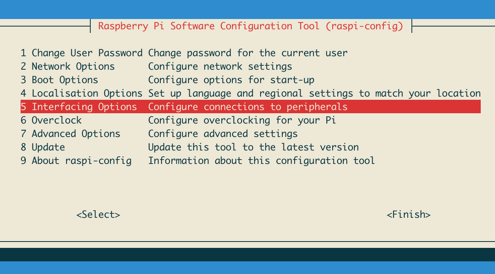
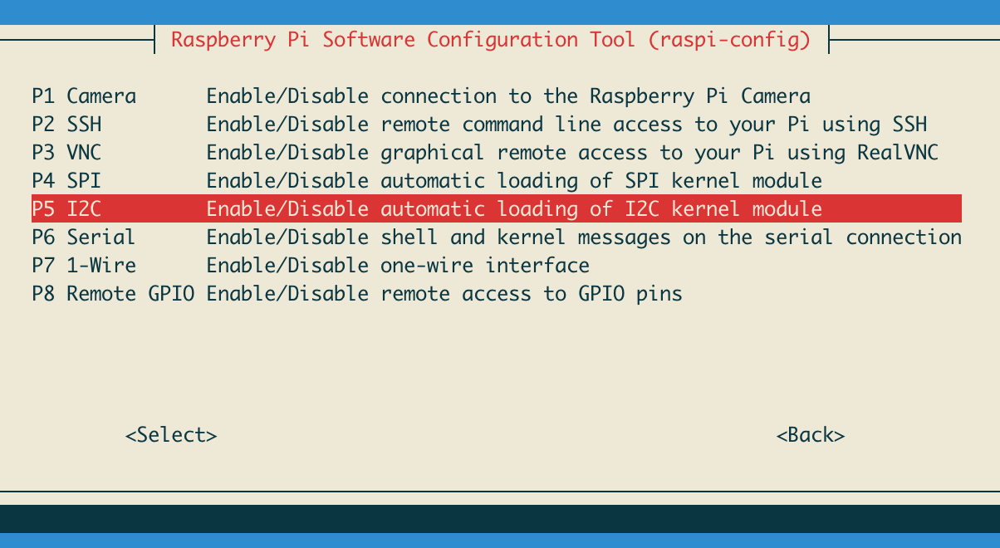
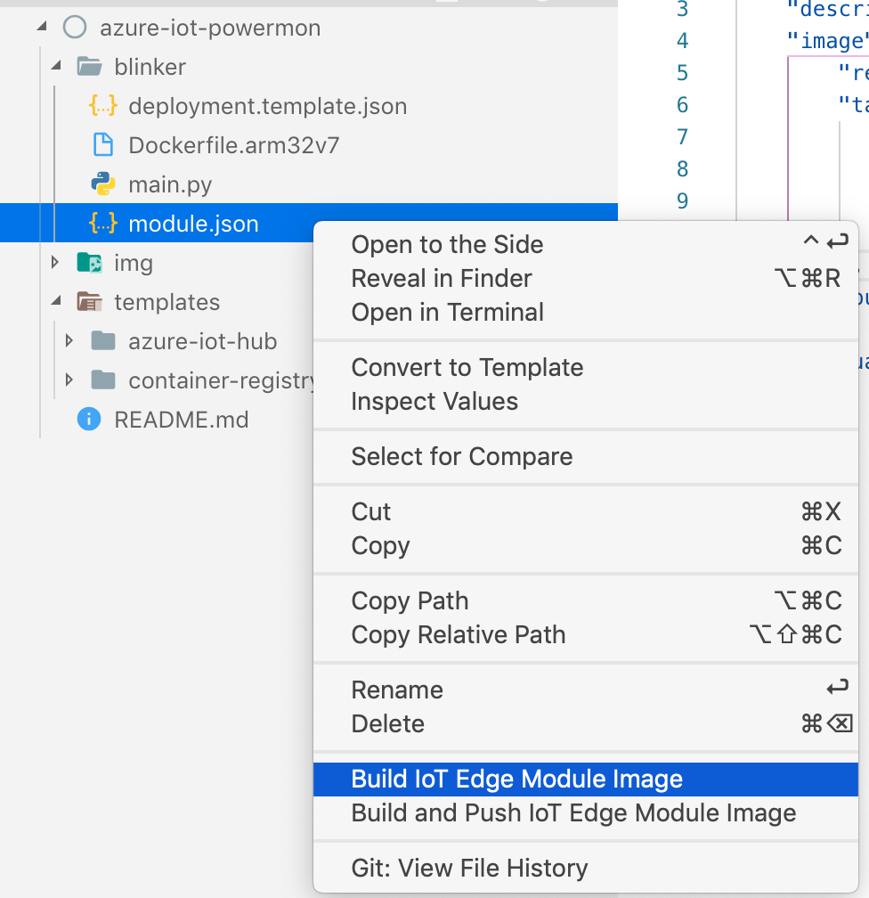

# PowerMon

## Setup

### Raspberry Pi

* Download [Rasbian lite image](https://www.raspberrypi.org/downloads/raspbian/)

```bash
wget http://director.downloads.raspberrypi.org/raspbian_lite/images/raspbian_lite-2019-07-12/2019-07-10-raspbian-buster-lite.zip
```

#### Burn Image

* Burn the image with [Etcher](https://www.balena.io/etcher/)

#### Setup WiFi

```bash
touch /Volumes/boot/ssh
touch /Volumes/boot/wpa_supplicant.conf
nano /Volumes/boot/wpa_supplicant.conf

# Add the following config
country=AU
ctrl_interface=DIR=/var/run/wpa_supplicant GROUP=netdev
update_config=1

network={
    ssid="NETWORK-NAME"
    psk="NETWORK-PASSWORD"
}
```

#### Connect to Pi

```bash
ssh-keygen -R raspberrypi.local
ssh pi@raspberrypi.local
# password: rasbperry
```

Update the system

```bash
sudo apt-get update -y
sudo apt-get upgrade -y
```

#### I2C Requirements

```bash
sudo apt-get install -y python-smbus i2c-tools
```

Enable I2C by going into raspi-config

```bash
sudo raspi-config
```





Reboot the Pi (`sudo reboot`), log back in and then run the following to test I2C

```bash
sudo i2cdetect -y 1
```

#### Install Azure IoT Edge

Setup IoT Edge based on the guide - [https://docs.microsoft.com/en-au/azure/iot-edge/how-to-install-iot-edge-linux](https://docs.microsoft.com/en-au/azure/iot-edge/how-to-install-iot-edge-linux)

```bash
# Import repos and signing keys
curl https://packages.microsoft.com/config/debian/stretch/multiarch/prod.list > ./microsoft-prod.list
sudo cp ./microsoft-prod.list /etc/apt/sources.list.d/
curl https://packages.microsoft.com/keys/microsoft.asc | gpg --dearmor > microsoft.gpg
sudo cp ./microsoft.gpg /etc/apt/trusted.gpg.d/

# Install moby engine & cli
sudo apt-get install moby-engine
sudo apt-get install moby-cli

# Install IoT edge security daemon
sudo apt-get update
sudo apt-get install iotedge
```

**NOTE**: You might get an error on `aufs-dkms`. Run the following

```bash
sudo apt-get install \
    apt-transport-https \
    ca-certificates \
    curl \
    gnupg2 \
    software-properties-common

curl -fsSL https://download.docker.com/linux/debian/gpg | sudo apt-key add -
sudo apt-key fingerprint 0EBFCD88

sudo add-apt-repository \
   "deb [arch=armhf] https://download.docker.com/linux/debian \
   $(lsb_release -cs) \
   stable"

sudo apt-get update
sudo apt-get install docker-ce docker-ce-cli containerd.io
sudo usermod -a -G docker $USER

# Install IoT edge security daemon
sudo apt-get update
sudo apt-get install iotedge

# Work around for a small bug
sudo apt-get install libssl1.0.2
```

We'll come back soon to configure the security daemon

### Azure IoT

#### Azure CLI Setup

```bash
brew update && brew install azure-cli
```

Login to the CLI

```bash
az login
```

#### IoT Hub Deploy

```bash
cd templates/azure-iot-hub
./deploy.sh

# Your subscription ID can be looked up with the CLI using: az account show --out json
# Enter your subscription ID:
XXXXXXX-XXXXXXXXXX-XXXXXXXXXXXX-XXXXXXXXXX
# This script will look for an existing resource group, otherwise a new one will be created
# You can create new resource groups with the CLI using: az group create
# Enter a resource group name
azure-iot-powermon
# Enter a name for this deployment:
azure-iot-powermon-iot-hub
# If creating a *new* resource group, you need to set a location
# You can lookup locations with the CLI using: az account list-locations
# Enter resource group location:
australiasoutheast
```

#### IoT Device Create

```bash
az iot hub device-identity create \
    --device-id "powermon-rpi-01" \
    --hub-name "azure-iot-powermon-hub" \
    --edge-enabled
# {
#   "authentication": {
#     "symmetricKey": {
#       "primaryKey": "XXXXXXXXXXXXXXXXXXXXXXXXXXXXXXXXXXXXXXX",
#       "secondaryKey": "XXXXXXXXXXXXXXXXXXXXXXXXXXXXXXXXXXXXXXX"
#     },
#     "type": "sas",
#     "x509Thumbprint": {
#       "primaryThumbprint": null,
#       "secondaryThumbprint": null
#     }
#   },
#   "capabilities": {
#     "iotEdge": true
#   },
#   "cloudToDeviceMessageCount": 0,
#   "connectionState": "Disconnected",
#   "connectionStateUpdatedTime": "0001-01-01T00:00:00",
#   "deviceId": "powermon-rpi-01",
#   "deviceScope": "ms-azure-iot-edge://powermon-rpi-01-637002575398722524",
#   "etag": "NDA5OTUzNzQ3",
#   "generationId": "637002575398722524",
#   "lastActivityTime": "0001-01-01T00:00:00",
#   "status": "enabled",
#   "statusReason": null,
#   "statusUpdatedTime": "0001-01-01T00:00:00"
# }
```

Get the connection string

```bash
az iot hub device-identity show-connection-string \
    --device-id "powermon-rpi-01" \
    --hub-name "azure-iot-powermon-hub"
# {
#   "connectionString": "HostName=azure-iot-powermon-hub.azure-devices.net;DeviceId=powermon-rpi-01;SharedAccessKey=XXXXXXXXXXXXXXXXXXXXXXXXXXXXXXXXXXXXXXX"
# }
```

#### Raspberry Pi Connection Daemon

Open the following file (or create it if it doesnt exist)

```bash
sudo nano /etc/iotedge/config.yaml
```

Update the `device_connection_string` with the connection string from above

```yaml
# Manual provisioning configuration
provisioning:
  source: "manual"
  device_connection_string: "<ADD DEVICE CONNECTION STRING HERE>"
```

Restart the edgeiot service

```bash
systemctl status iotedge
# ● iotedge.service - Azure IoT Edge daemon
#    Loaded: loaded (/lib/systemd/system/iotedge.service; enabled; vendor preset: enabled)
#    Active: active (running) since Thu 2019-08-01 14:02:40 BST; 6s ago
#      Docs: man:iotedged(8)
#  Main PID: 18638 (iotedged)
#     Tasks: 10 (limit: 2200)
#    Memory: 9.9M
#    CGroup: /system.slice/iotedge.service
#            └─18638 /usr/bin/iotedged -c /etc/iotedge/config.yaml

# Aug 01 14:02:40 raspberrypi iotedged[18638]: 2019-08-01T13:02:40Z [INFO] - Using runtime network id azure-iot-edge
# Aug 01 14:02:40 raspberrypi iotedged[18638]: 2019-08-01T13:02:40Z [INFO] - Initializing the module runtime...
# Aug 01 14:02:40 raspberrypi iotedged[18638]: 2019-08-01T13:02:40Z [INFO] - Initializing module runtime...
# Aug 01 14:02:41 raspberrypi iotedged[18638]: 2019-08-01T13:02:41Z [INFO] - Successfully initialized module runtime
# Aug 01 14:02:41 raspberrypi iotedged[18638]: 2019-08-01T13:02:41Z [INFO] - Finished initializing the module runtime.
# Aug 01 14:02:41 raspberrypi iotedged[18638]: 2019-08-01T13:02:41Z [INFO] - Configuring /var/lib/iotedge as the home directory.
# Aug 01 14:02:41 raspberrypi iotedged[18638]: 2019-08-01T13:02:41Z [INFO] - Configuring certificates...
# Aug 01 14:02:41 raspberrypi iotedged[18638]: 2019-08-01T13:02:41Z [INFO] - Transparent gateway certificates not found, operating in quick start mode...
# Aug 01 14:02:41 raspberrypi iotedged[18638]: 2019-08-01T13:02:41Z [INFO] - Finished configuring certificates.
# Aug 01 14:02:41 raspberrypi iotedged[18638]: 2019-08-01T13:02:41Z [INFO] - Initializing hsm...
# ...
# Aug 01 14:07:03 raspberrypi iotedged[18638]: 2019-08-01T13:07:03Z [INFO] - Checking edge runtime status
# Aug 01 14:07:03 raspberrypi iotedged[18638]: 2019-08-01T13:07:03Z [INFO] - Edge runtime is running.
# Aug 01 14:07:03 raspberrypi iotedged[18638]: 2019-08-01T13:07:03Z [INFO] - Checking edge runtime status
# Aug 01 14:07:03 raspberrypi iotedged[18638]: 2019-08-01T13:07:03Z [INFO] - Edge runtime is running.
# Aug 01 14:07:20 raspberrypi iotedged[18638]: 2019-08-01T13:07:20Z [INFO] - Querying system info...
# Aug 01 14:07:20 raspberrypi iotedged[18638]: 2019-08-01T13:07:20Z [INFO] - Successfully queried system info
```

List the Modules running on the device

```bash
sudo iotedge list
```

#### Container Registry Create

```bash
cd templates/container-registry
./deploy.sh

# Your subscription ID can be looked up with the CLI using: az account show --out json
# Enter your subscription ID:
XXXXXXX-XXXXXXXXXX-XXXXXXXXXXXX-XXXXXXXXXX
# This script will look for an existing resource group, otherwise a new one will be created
# You can create new resource groups with the CLI using: az group create
# Enter a resource group name
azure-iot-powermon
# Enter a name for this deployment:
azure-iot-powermon-registry
# If creating a *new* resource group, you need to set a location
# You can lookup locations with the CLI using: az account list-locations
# Enter resource group location:
australiasoutheast
```

This created a container registry for me called `glover`

Login to docker

```bash
az acr login --name "glover"
```

#### Blinker Module Deploy

Update the code in [blinker/module.json](blinker/module.json) to the correct registry. Then to deploy, either install the [Azure IoT Edge extension](https://github.com/microsoft/vscode-azure-iot-edge) then right click `module.json` and run deploy.

Alternatively run the following substituting in the correct information

```bash
docker build  --rm -f ./blinker/Dockerfile.arm32v7 -t glover.azurecr.io/blinkler:0.0.1-arm32v7 ./blinker && docker push glover.azurecr.io/blinkler:0.0.1-arm32v7
```

Get your credentials for your repository

```bash
az acr update --name "glover" --admin-enabled true
az acr credential show --name "glover"
```

You need to add credentials for the repository to auth. Change this in `config/deployment.json`

```json
"registryCredentials": {
    "glover": {
        "username": "glover",
        "password": "XXXXXXXXXXXXXXXXXXXXXXXXXXXXXXXXXXX",
        "address": "glover.azurecr.io"
    }
}
```

Once pushed to ACR, you can update the deployment to the Raspberry Pi.



## Attribution

* [https://desertbot.io/blog/headless-raspberry-pi-3-bplus-ssh-wifi-setup](https://desertbot.io/blog/headless-raspberry-pi-3-bplus-ssh-wifi-setup)
* [https://docs.microsoft.com/en-au/azure/iot-edge/how-to-install-iot-edge-linux#configure-the-security-daemon](https://docs.microsoft.com/en-au/azure/iot-edge/how-to-install-iot-edge-linux#configure-the-security-daemon)
* [https://www.hackster.io/saka/azure-iot-edge-for-dummies-blink-an-led-e8b2e4](https://www.hackster.io/saka/azure-iot-edge-for-dummies-blink-an-led-e8b2e4)
