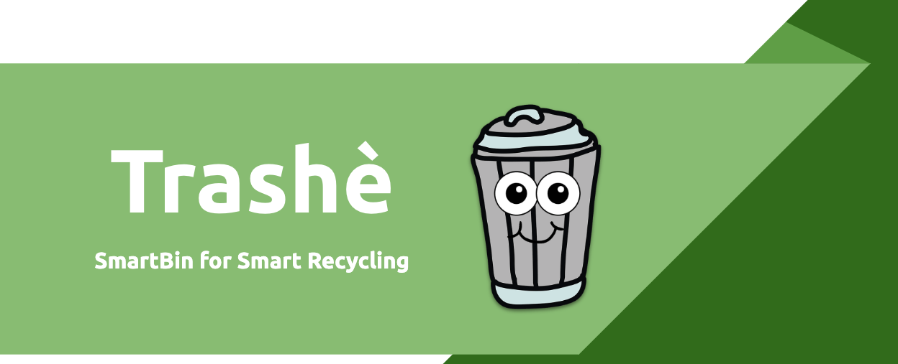
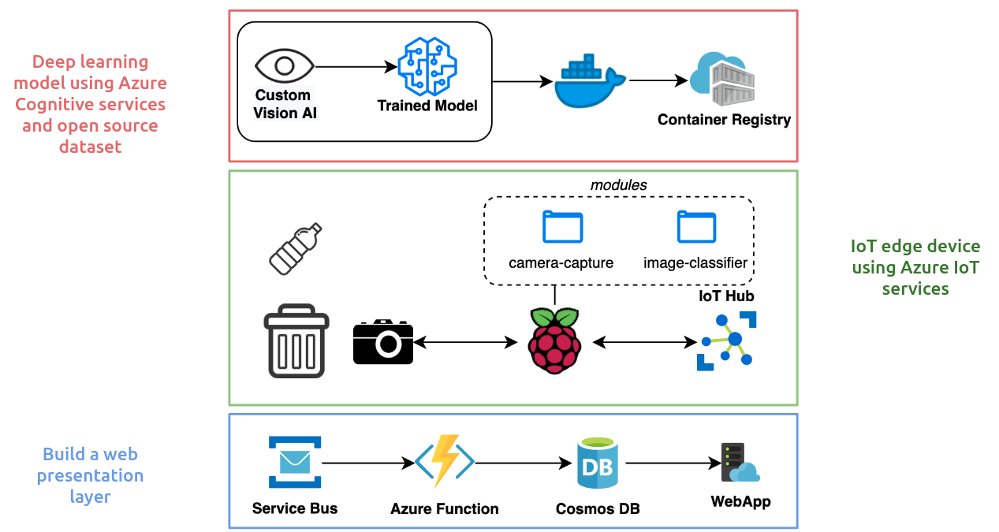
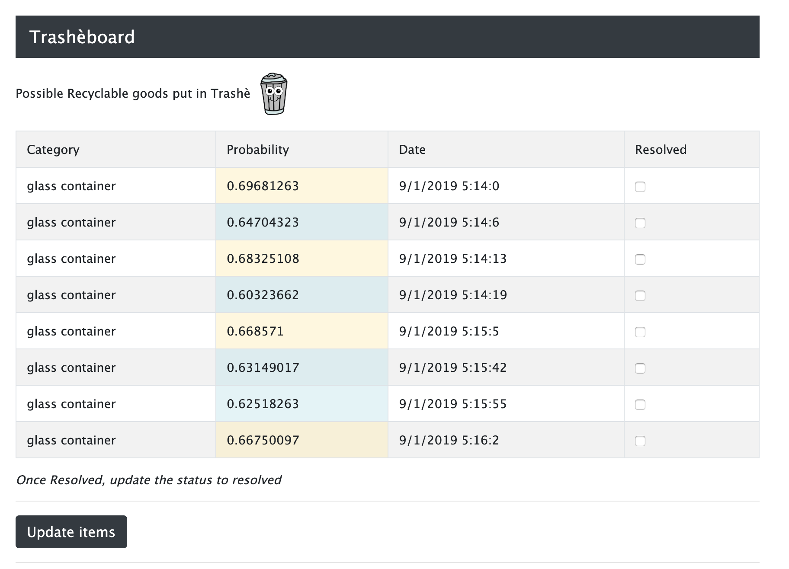

# Trashè

Trashè is a SmartBin which aim to help you get better at recycling.

Making use of Azure IoT Edge we're able to leverage our trash detection model to detect plastic, glass & metals in realtime.

## Design

---

## Architecture

---

## Setup

---

* [01_custom_vision](instructions/01_custom_vision/README.md)
  * [01_custom_vision_model](instructions/01_custom_vision/01_custom_vision_model.md)
  * [02_container_registry](instructions/01_custom_vision/02_container_registry.md)
* [02_iot](instructions/02_iot/README.md)
  * [01_raspberry_pi](instructions/02_iot/01_raspberry_pi.md)
  * [02_azure_iot_edge](instructions/02_iot/02_azure_iot_edge.md)
  * [03_azure_iot](instructions/02_iot/03_azure_iot.md)
  * [04_blinker](instructions/02_iot/04_blinker.md)
  * [05_usb_camera](instructions/02_iot/05_usb_camera.md)
  * [06_camera_capture](instructions/02_iot/06_camera_capture.md)
  * [07_image_classifier_service](instructions/02_iot/07_image_classifier_service.md)
* [03_web](instructions/03_web/README.md)
  * [01_service_bus](instructions/03_web/01_service_bus.md)
  * [02_queue_process](instructions/03_web/02_queue_process.md)
  * [03_cosmos_db_webapp](instructions/03_web/03_cosmos_db_webapp.md)
  * [04_queue_processing_revisited](instructions/03_web/04_queue_processing_revisited.md)

## Web

---

## Attribution

---

* [https://desertbot.io/blog/headless-raspberry-pi-3-bplus-ssh-wifi-setup](https://desertbot.io/blog/headless-raspberry-pi-3-bplus-ssh-wifi-setup)
* [https://docs.microsoft.com/en-au/azure/iot-edge/how-to-install-iot-edge-linux#configure-the-security-daemon](https://docs.microsoft.com/en-au/azure/iot-edge/how-to-install-iot-edge-linux#configure-the-security-daemon)
* [https://www.hackster.io/saka/azure-iot-edge-for-dummies-blink-an-led-e8b2e4](https://www.hackster.io/saka/azure-iot-edge-for-dummies-blink-an-led-e8b2e4)
* [https://github.com/Azure-Samples/Custom-vision-service-iot-edge-raspberry-pi](https://github.com/Azure-Samples/Custom-vision-service-iot-edge-raspberry-pi)
* [https://docs.microsoft.com/en-us/azure/cognitive-services/custom-vision-service/getting-started-build-a-classifier?WT.mc_id=devto-blog-dglover](https://docs.microsoft.com/en-us/azure/cognitive-services/custom-vision-service/getting-started-build-a-classifier?WT.mc_id=devto-blog-dglover)
* [https://github.com/gloveboxes/Creating-an-image-recognition-solution-with-Azure-IoT-Edge-and-Azure-Cognitive-Services](https://github.com/gloveboxes/Creating-an-image-recognition-solution-with-Azure-IoT-Edge-and-Azure-Cognitive-Services)
* [https://dev.to/azure/azure-iot-edge-on-raspberry-pi-buster-plus-tips-for-raspberry-pi-4-22nn](https://dev.to/azure/azure-iot-edge-on-raspberry-pi-buster-plus-tips-for-raspberry-pi-4-22nn)
