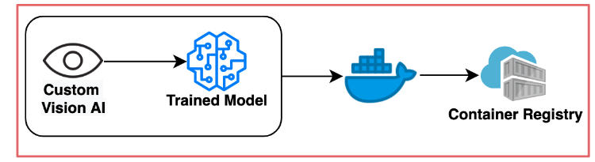

# Deep Learning model creation

This section deals with creating the classification .

It will guide you through the steps to:

* Create your custom vision model
* Create a Azure Docker Registry to securely hold docker images
* Deploy your exported vision model to this Docker registry.
