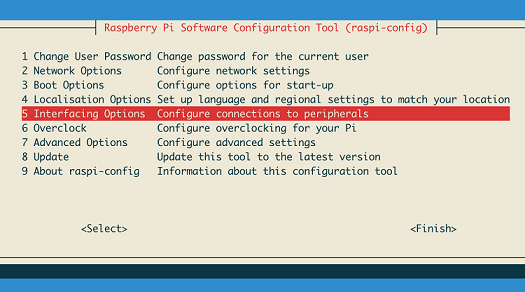
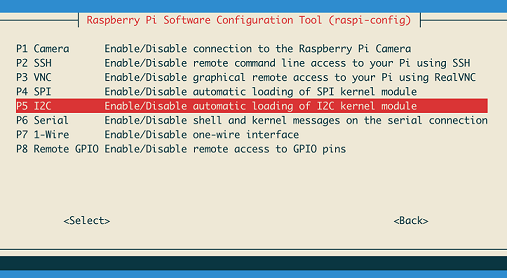

# Raspberry Pi

* Download [Rasbian lite image](https://www.raspberrypi.org/downloads/raspbian/)

```bash
wget http://director.downloads.raspberrypi.org/raspbian_lite/images/raspbian_lite-2019-07-12/2019-07-10-raspbian-buster-lite.zip
```

## Burn Image

* Burn the image with [Etcher](https://www.balena.io/etcher/)

## Setup WiFi

```bash
touch /Volumes/boot/ssh
touch /Volumes/boot/wpa_supplicant.conf
nano /Volumes/boot/wpa_supplicant.conf

# Add the following config
country=AU
ctrl_interface=DIR=/var/run/wpa_supplicant GROUP=netdev
update_config=1

network={
    ssid="NETWORK-NAME"
    psk="NETWORK-PASSWORD"
}
```

## Connect to Pi

```bash
ssh-keygen -R raspberrypi.local
ssh pi@raspberrypi.local
# password: rasbperry
```

Update the system

```bash
sudo apt-get update -y
sudo apt-get upgrade -y
```

## I2C Requirements

```bash
sudo apt-get install -y python-smbus i2c-tools
```

Enable I2C by going into raspi-config

```bash
sudo raspi-config
```





Reboot the Pi (`sudo reboot`), log back in and then run the following to test I2C

```bash
sudo i2cdetect -y 1
```
