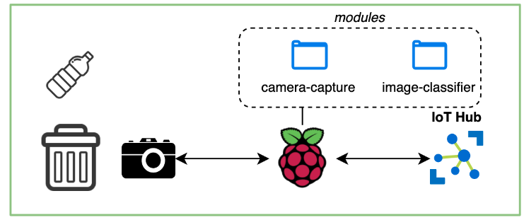

# Creating IoT Device

* Set up Raspberry Pi to become an IoT device
* Install Azure IoT Edge
* Test connection by blinking a LED from Azure IoT
* Capturing images from a camera connected to the Raspberry Pi
* Deploying your custom vision model to the Raspberry Pi
