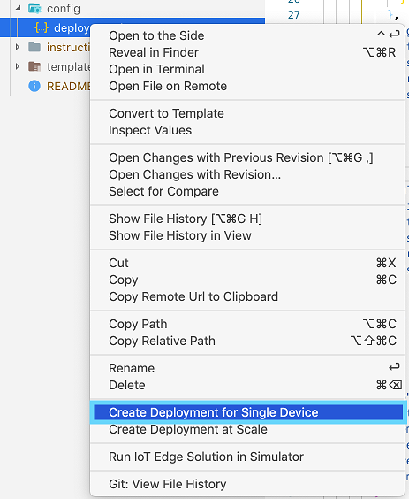

# Blinker Module Deploy

Update the code in [modules/blinker/module.json](../modules/blinker/module.json) to the correct registry. Then to deploy, either install the [Azure IoT Edge extension](https://github.com/microsoft/vscode-azure-iot-edge) then right click `module.json` and run Build and Push.


Alternatively run the following substituting in the correct information

```bash
docker build  --rm -f ./modules/blinker/Dockerfile.arm32v7 -t glover.azurecr.io/blinkler:0.0.1-arm32v7 ./modules/blinker && docker push glover.azurecr.io/blinkler:0.0.1-arm32v7
```

Get your credentials for your repository

```bash
az acr update --name "glover" --admin-enabled true
az acr credential show --name "glover"
```

You need to add credentials for the repository to auth. Change this in `.env` (make a copy of `.env.sample`)

```json
CONTAINER_REGISTRY_ADDRESS="glover.azurecr.io"
CONTAINER_REGISTRY_USERNAME="glover"
CONTAINER_REGISTRY_PASSWORD="XXXXXXXXXXXXXXXXXXXXXXXXXXXXXXXXXXX"
```

Once pushed to ACR, you can update the deployment to the Raspberry Pi. This is also done within the `deployment.template.json` file

```json
"modules": {
  "blinkler": {
    "version": "1.0",
    "type": "docker",
    "status": "running",
    "restartPolicy": "always",
    "settings": {
      "image": "${MODULES.blinkler.arm32v7}",
      "createOptions": {"HostConfig":{"Privileged": true}}
    }
  }
}
```


