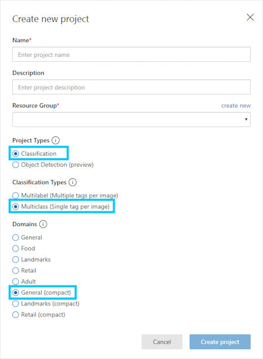
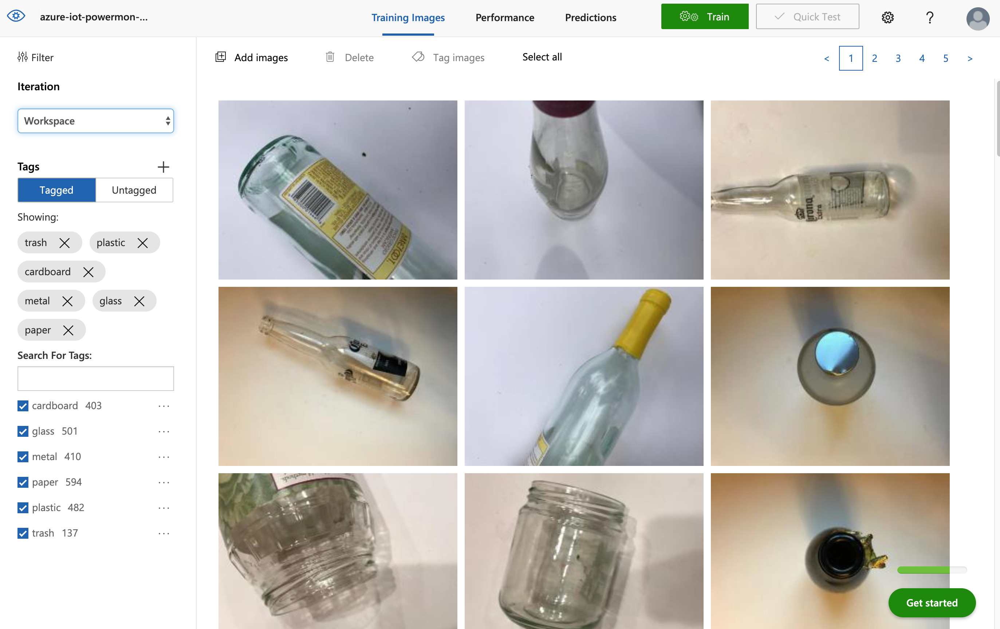
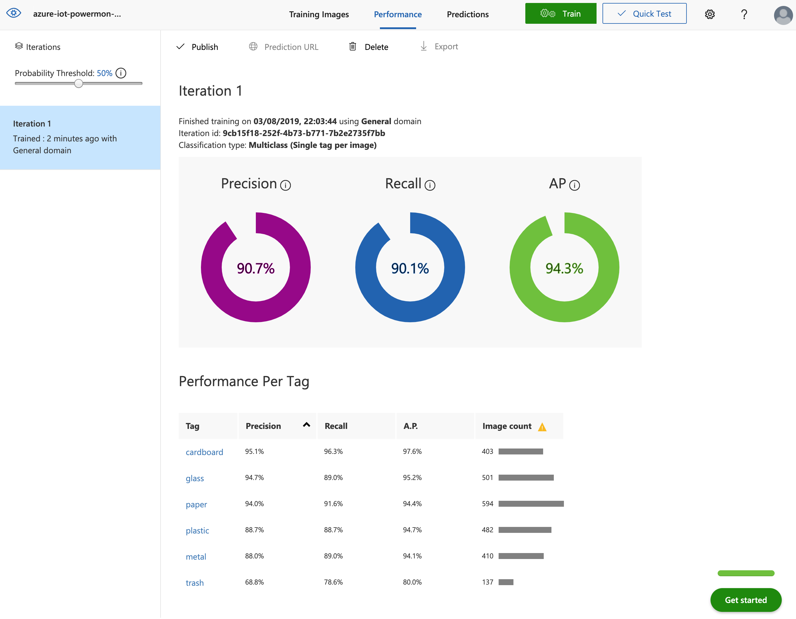

# Custom Vision Model Creation

## Custom Vision Deploy

```bash
cd templates/custom-vision
./deploy.sh

# Your subscription ID can be looked up with the CLI using: az account show --out json
# Enter your subscription ID:
XXXXXXX-XXXXXXXXXX-XXXXXXXXXXXX-XXXXXXXXXX
# This script will look for an existing resource group, otherwise a new one will be created
# You can create new resource groups with the CLI using: az group create
# Enter a resource group name
azure-iot-powermon
# Enter a name for this deployment:
azure-iot-powermon-vison
# If creating a *new* resource group, you need to set a location
# You can lookup locations with the CLI using: az account list-locations
# Enter resource group location:
australiasoutheast
```

## Custom Vision Train

Navigate to the [https://www.customvision.ai/projects](https://www.customvision.ai/projects) page.

Create a new project and model selecting the following settings



Make use of [Trashnet](https://github.com/garythung/trashnet) to build a trash dataset





Export the model along with the Dockerfile. Replace the `labels.txt` and `model.pb` in `modules/image-classifier`


